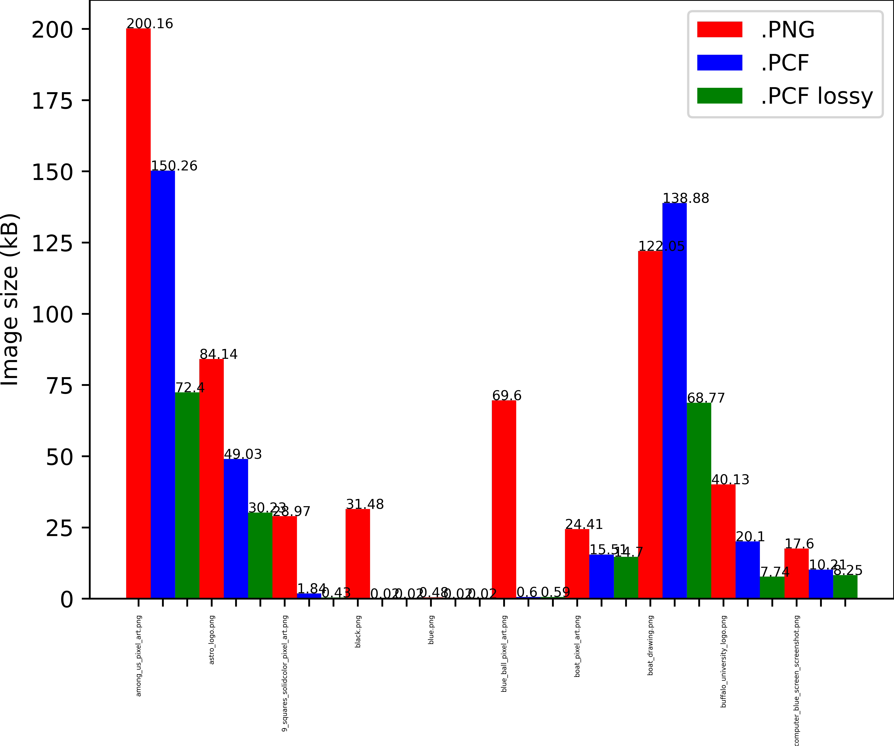
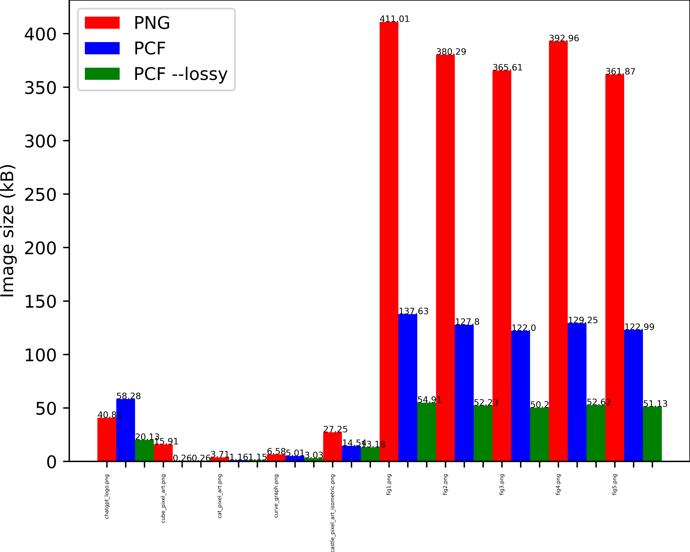
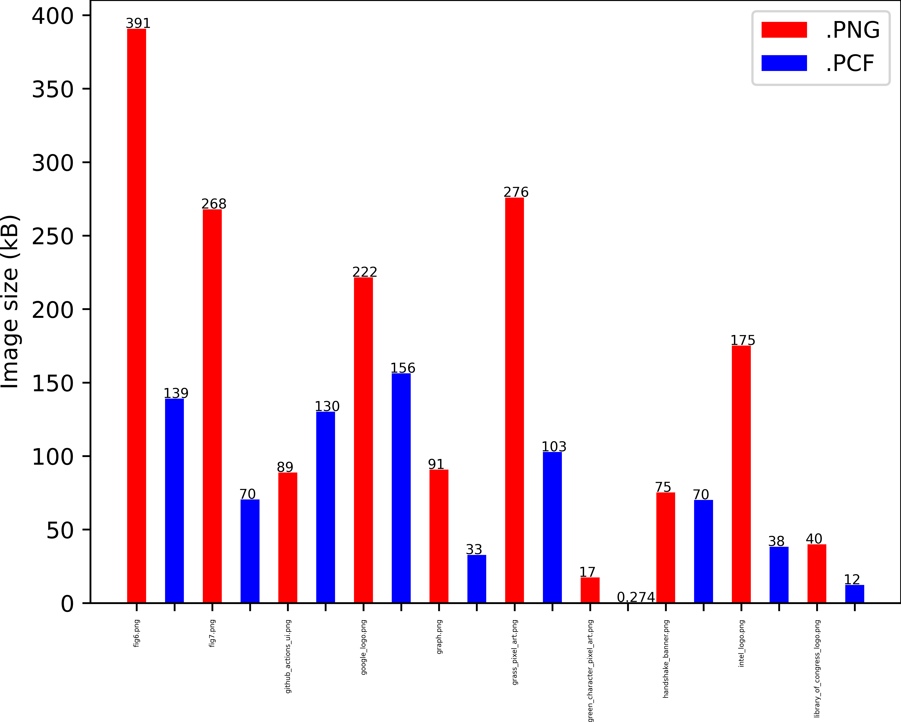
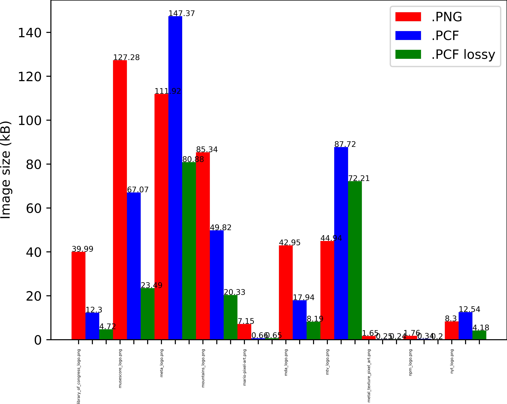
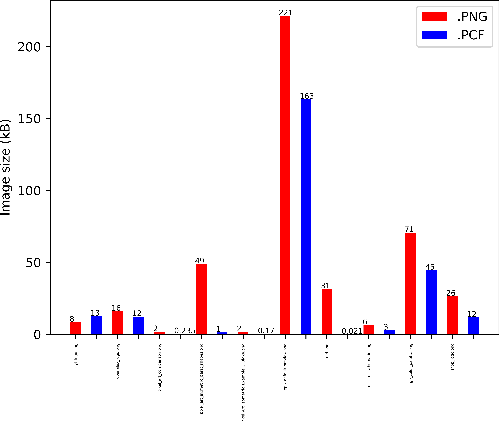
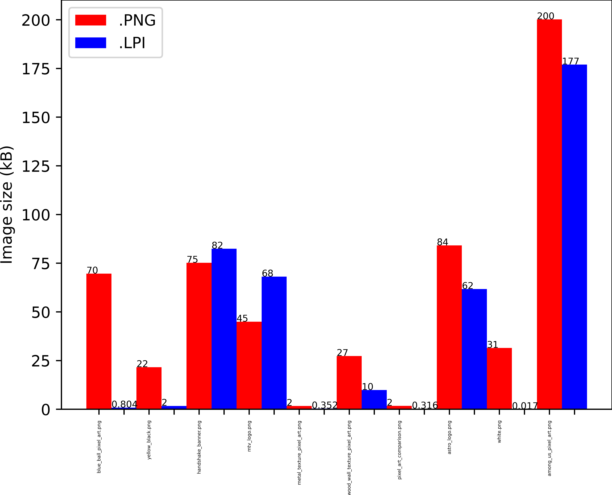
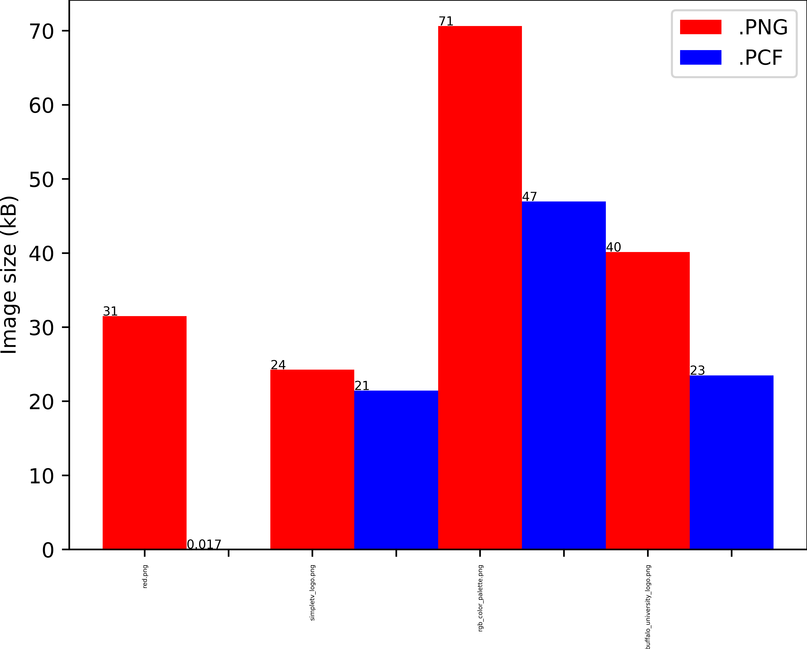

# Lossless Pixel-Clustering Image Format (LPI)
### About
LPI is an image format that works by grouping pixels together in clusters that rely on simple additions and multiplications for compression, and grouping them by color.

### How
It uses "layers" to store pixels, that is it completely disregards the pixels of the dominant color in the image, using it as a "background". Then, it fills in the image using the other colors, thus allowing for a very efficient lossless compression. 

1. For example, imagine a black 1*5 image. You could theoretically represent all the pixels inside of this image as a list of tuples (x,y) : `[(0,0), (0,1), (0,2), (0,3), (0,4)]`. But then, this isn't very efficient: we just wrote the same abscissa five times in a row. What if we could save space by factoring them by their abscissa (or ordinate) ? That's exactly what LPI does, by representing the same pixels like this: `0:[0,1,2,3,4]`. Now that's more compact. 
2. But what if our image is bigger ? For example, let's say our image is 5x5:\
`
[(0,0), (0,1), (0,2), (0,3), (0,4),
(1,0), (1,1), (1,2), (1,3), (1,4),
(2,0), (2,1), (2,2), (2,3), (2,4),
(3,0), (3,1), (3,2), (3,3), (3,4),
(4,0), (4,1), (4,2), (4,3), (4,4)]
`\
In that case, our previous method gives us this:\
`0:[0,1,2,3,4], 1:[0,1,2,3,4], 2:[0,1,2,3,4], 3:[0,1,2,3,4], 4:[0,1,2,3,4]`\
Which isn't great space-wise. However, there's a way to make it more compact. We have the same list five times in row, thus we basically re-use the previous method, which returns this:
`[0,1,2,3,4]:[0,1,2,3,4]`\
That's better!
3. But then, same as last time, this becomes very inefficient for bigger images. Let's consider a black image of size (x,x) with x>10. With our previous method, we get this:
`[0,1,2,3,4,...,x-1]:[0,1,2,3,4,...,x-1]`. The bigger x gets, the more wasteful this is. With x=10000, the end of each list would look like this:`..., 9998, 9999`.\
The answer lies in sums. Instead of writing all those big numbers, we can write, "0+1+1+1+1+1+1+1+1+1+1+1+1+1+1+1+1+1......", each addition representing a number. Of course, this works even if the numbers are not evenly spaced apart (e.g. you could have "0+1+10+2+4+5+1+99").
4. However, that's not super compact. Why write the same addition 9999 times in a row ? This is the last step. LPI simply writes "0+1\*9999". This also works with different numbers, like: "0+1\*932+2\*34+1+7+4+56+3\*23"

This works great, but less so for images which contain thousands and thousands of colors and not many pixels per color, as LPI's method is given less "space" to work properly.

### More info
On images where it works best, LPI offers a great compression level, sometimes being as much as 99% smaller than the original PNG image. However, it poorly compresses colors and their relation with pixels and as such, LPI works best with images that don't have a ton of colors and/or that have a high pixel/color ratio. Examples below (the graphs in the .LPI format are 47% to 62% smaller than their heavily optimized PNG original counterparts).

LPI supports transparency, and first reads colors in the RGBA format and then stores them in the hexadecimal format.

## Installation

```bash
git clone https://github.com/just-a-mango/lpi
```

## Usage

```sh
python convert.py [filename] [-o] [-v] [-d]

python back_convert.py [filename]

positional arguments:
  filename

options:
  -o, --output    The .lpi output file
  -v, --verbose
  -d, --dev       Disable LZMA compression (makes the file readable)
```

## Comparisons with PNG








## Examples
### Blue image
#### PNG:

484 bytes
#### LPI:
```
1920-1080#0000fe-*
```
18 bytes (~27 times smaller)

### Blue ball pixel art
#### PNG:

70 kB
#### LPI:
804 bytes (~86 times smaller)

### Google logo
#### PNG:

222 kB
### LPI:
173 kB (22% smaller)


## Contributing

Feel free to submit pull requests. If you're considering significant changes, please open an issue first to discuss your ideas.

## License

[MIT License](LICENSE)
