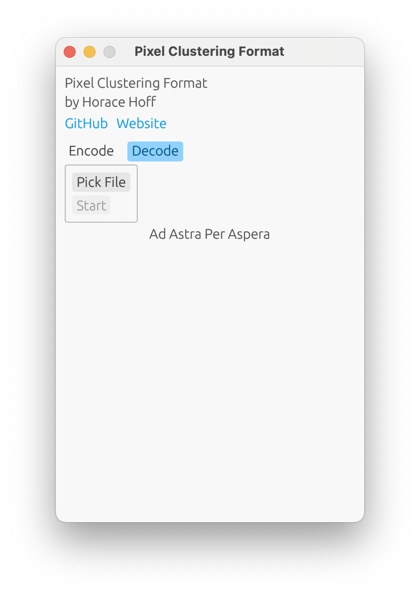

# Pixel-Clustering Format (.PCF)
### About
PCF is a lossless image format that compresses images by clustering pixels of the same color, using simple arithmetic operations like addition and multiplication. It achieves high compression rates by eliminating redundant color information and efficiently encoding pixel positions.

PCF supports lossy compression, by dithering the image using Floyd-Steinberg dithering, using a custom color palette list generated on a per-pixel basis by scanning the surrounding pixels.
The difference in visual quality is usually indistinguishable to the naked eye, but drastically reduces the size of images.

### How
PCF organizes images into layers, and completely disregards the pixels of the dominant color, which is treated as a background color.
Here is how PCF works:
1. **Basic clustering**\
A simple 1×5 black image:\
*Standard representation*: `[(0,0), (0,1), (0,2), (0,3), (0,4)]`\
*PCF representation*: `0:[0,1,2,3,4]` (factoring out the redundant x-coordinate / y-coordinate).
2. **Second clustering step**\
A 5x5 black image:\
*Previous method*: `0:[0,1,2,3,4], 1:[0,1,2,3,4], 2:[0,1,2,3,4], 3:[0,1,2,3,4], 4:[0,1,2,3,4]`\
*PCF representation*: `[0,1,2,3,4]:[0,1,2,3,4]` (grouping repeated structures
3. **Transforming lists into additions**\
*Previous representation*: `[0,1,2,3,4]:[0,1,2,3,4]`\
*PCF representation*: `0+1+1+1+1:0+1+1+1+1`
4. **Transforming repeated additions into multiplications**\
*Previous representation*: `0+1+1+1+1:0+1+1+1+1`\
*PCF representation*: `0+1*4:0+1*4`
5. **Optimizing repeated patterns**\
*Previous representation*: `0+1*4:0+1*4`\
*PCF representation*: `a:a` + appends `$0+1*4$a` at the end of the file

### Performance & Limitations
PCF excels in images with a high pixel-to-color ratio, achieving compression rates up to 99% smaller than PNG. However, it struggles with images containing many distinct colors, where clustering is less effective.
PCF supports transparency.

## Installation

```bash
git clone https://github.com/horacehoff/pixel-clustering-format
```

## Usage
PCF can be used directly:
```sh
cargo run --release -- [filename] [--lossy OR --decode]
// OR
./pcf [filename] [--lossy OR --decode]
```

Or it can be used with its GUI, by simply launching the binary with no arguments:



## Comparisons with PNG


## Examples
### Blue image
#### PNG:

484 bytes
#### LPI:
```
1920%1080%#0000FE%
```
18 bytes (~27 times smaller)

### Blue ball pixel art
#### PNG:

70 kB
#### PCF:

595 bytes (~120 times smaller)
<details>
<summary>Uncompressed</summary>

```
1408%1402%#6E92A2%#F1F2D4{306+1*219:966+1*87,218+1*87:614a3,218+1*263:746+1*131,394+1*87:1098a3,218+1*219:702a3,350+1*175:1054a3,262+1*263:878+1*87,218+1*175:658a3}#1E3147{306a3:307a3,965+1*87:1142a3,1097a3:1054a3,1141a3:966+1*87,262a3:351a3,1185a3:439+1*87+352+1*87,394+1*87:219a3,482+1*87:175a3,658+1*218:1230a3,877+1*87:1186a3,350a3:263a3,570+1*306:131a3,1053a3:1098a3,1229a3:527+1*350}#385165{746+1*306:1098a3,1053+1*175:834a3,1141a3:483a3,746+1*130:1186a3,350a3+748a3:351a3,702a3+264+1*175:922a3,350+1*131:307a3,746+1*218:1142a3,262a3+836a3:395a3,702+1*87+176+1*175:966a3,702+1*87+132+1*219:1010a3,1009+1*175:878a3,1141+1*87:527+1*306,394+1*87:263a3,746+1*87+44+1*219:1054a3}#242424{0+1*1401:1406+1}#85B0B5{350a3+265+1*87:1098a3,658a3:1010a3,174a3+353+1*87:834a3,262a3+485+1*350:439a3,482+1*87+45+1*131:1186a3,174a3+265+1*87:658a3,702+1*306:351a3,174a3+221+1*87:570a3,658+1*87:1054a3,746+1*306:395a3,174a3+265+1*131:702+1*87,570+1*87:878a3,614+1*87:922+1*87,658+1*306:307a3,174a3+309+1*87:790a3,174+1*87+133+1*87+353+1*130:527a2,174a3+265a3:614a3,262a3+485+1*262:483a3,658+1*262:219+1*87,658+1*218:175a3,394+1*87+177+1*87:1142a3}#587084{790+1*174+221+1*87:966a3,658+1*350+221+1*87:878a3,658+1*350+89a3+133a3:746a3,658+1*394+221a3:834a3,702+1*262+133a3+133a3:702a3,526+1*219+528a3:527a2,306a3+45+1*87+704+1*131:351a3,702+1*218+177a3+133a3:658a3,1185a3:43a3,482a3+572a3+45+1*131:307a3,218a3+177+1*131+572a3+45+1*87:439a3,746+1*262+221+1*87:922a3,570a3+264+1*87+221+1*87:175a3,570+1*87:1230a3,482a3+528a3+89+1*131:263a3,482+1*87+396+1*87+133+1*87:219a3,306a3+45+1*131+660+1*131:395a3,834a2+309a3:1054a3,570+1*219+484a3:570a3,658+1*218+397a3:614a3,790+1*130+265+1*87:1010a3,1185+1*87:87+1*87,218a3+221+1*175+572+1*87:483a3,614a38+45a3+133a3:790a3}#BAD4CF{262a3+221+1*131:1010a3,306a3:439a3,218a3+265a3:878a3,921a3:219a3,218+1*219:570a3,262a3+221+1*87:966a3,921+1*131:263a3,438a3:702a3,482a3:790a3,262+1*131:527a2,1053+1*87:395a3,306a3+177+1*131:1054a3,482+1*87:834a3,394+1*87:658a3,1009+1*131:351a3,218a3+265+1*87:922a3,306+1*175:614a3,306+1*87:483a3,965+1*131:307a3,570a3:1186a3,482+1*175:1098+1*87}_$+1*4$a
```

</details>

### Google logo
#### PNG:

222 kB
### PCF:

156 kB (30% smaller)
